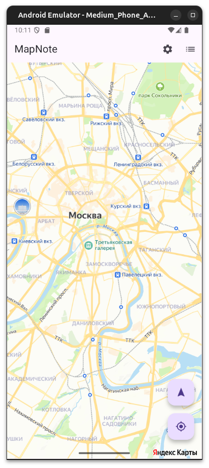
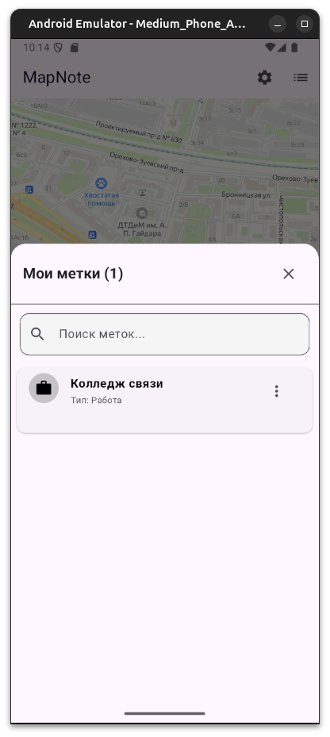
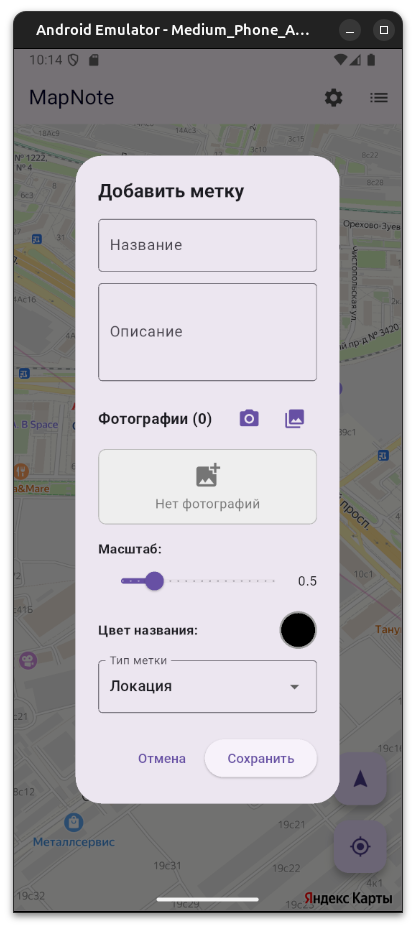

# MapNote - Приложение для геолокационных заметок

[](https://flutter.dev/)
[](https://dart.dev/)
[](LICENSE)

**MapNote** — мобильное приложение для создания и управления заметками с привязкой к географическим координатам.

---

## 📱 Скриншоты

| Главный экран | Список меток | Создание метки |
|---------------|--------------|----------------|
|  |  |  |

---

## ✨ Основной функционал

### Работа с метками:
- ✅ Создание меток на карте (нажатие/долгое нажатие)
- ✅ Редактирование и удаление меток
- ✅ Добавление фотографий (камера/галерея)
- ✅ Кастомизация (цвет, иконка, масштаб)
- ✅ 7 типов меток (Дом, Работа, Еда, Развлечение, Локация, Учеба, Разное)

### Навигация и поиск:
- ✅ Поиск меток по названию и описанию
- ✅ Фильтрация по типам
- ✅ Навигация к метке (Яндекс.Навигатор, Google Maps)
- ✅ Swipe-to-delete в списке меток

### Интеграция с картами:
- ✅ Yandex MapKit интеграция
- ✅ Управление картой (поворот на север, местоположение)
- ✅ Отображение меток с подписями

### Дополнительно:
- ✅ Темная тема
- ✅ Настройка размера шрифта
- ✅ Поделиться координатами
- ✅ Копировать координаты в буфер
- ✅ Локальное хранилище данных

---

## 🛠 Технологии

### Фреймворк и язык:
- **Flutter** 3.x
- **Dart** 3.x

### Основные библиотеки:
- `yandex_mapkit` - Интеграция карт Яндекса
- `provider` - State management
- `shared_preferences` - Локальное хранилище настроек
- `path_provider` - Работа с файловой системой
- `image_picker` - Работа с камерой и галереей
- `share_plus` - Функционал "Поделиться"
- `url_launcher` - Открытие внешних приложений

### Архитектура:
- **Model-View-Controller** (MVC)
- **Provider** для управления состоянием темы
- **Modular structure** (разделение на widgets, screens, models)

---

## 📦 Установка и запуск

### Требования:
- Flutter SDK 3.0 или выше
- Dart SDK 3.0 или выше
- Android Studio / Xcode (для эмуляторов)
- Yandex MapKit API ключ

### Шаг 1: Клонирование репозитория
```bash
git clone https://github.com/yourusername/mapnote.git
cd mapnote
```

### Шаг 2: Установка зависимостей
```bash
flutter pub get
```

### Шаг 3: Настройка Yandex MapKit API

1. Получите API ключ на [https://developer.tech.yandex.ru/](https://developer.tech.yandex.ru/)

2. Добавьте ключ в `android/app/src/main/AndroidManifest.xml`:
```xml
<meta-data
    android:name="com.yandex.mapkit.ApiKey"
    android:value="ВАШ_API_КЛЮЧ"/>
```

3. Для iOS добавьте в `ios/Runner/AppDelegate.swift`:
```swift
YMKMapKit.setApiKey("ВАШ_API_КЛЮЧ")
```

### Шаг 4: Запуск приложения
```bash
# Для Android
flutter run

# Для iOS
flutter run -d ios

# Для release сборки
flutter build apk --release
```

---

## 📁 Структура проекта
```
lib/
├── main.dart                    # Точка входа
├── map_screen.dart              # Главный экран с картой
├── settings_screen.dart         # Экран настроек
├── map_marker.dart              # Модель данных метки
├── storage.dart                 # Работа с локальным хранилищем
├── theme_provider.dart          # Управление темой приложения
└── widgets/                     # UI компоненты
    ├── add_marker_dialog.dart   # Диалог создания/редактирования метки
    ├── marker_details_sheet.dart # Детали метки
    ├── markers_list_sheet.dart  # Список всех меток
    └── map_controls.dart        # Кнопки управления картой
```

---

## 📊 Архитектура
```
┌─────────────────────────────────────┐
│         Presentation Layer          │
│   (MapScreen, Dialogs, Widgets)     │
└──────────────┬──────────────────────┘
               │
┌──────────────▼──────────────────────┐
│          Business Logic             │
│  (Storage, ThemeProvider, Models)   │
└──────────────┬──────────────────────┘
               │
┌──────────────▼──────────────────────┐
│           Data Layer                │
│  (JSON Files, SharedPreferences)    │
└─────────────────────────────────────┘
```

### Основные компоненты:

- **MapScreen**: Главный экран с картой и метками
- **Storage**: Управление сохранением и загрузкой данных
- **MapMarker**: Модель данных метки
- **ThemeProvider**: State management для темы
- **Widgets**: Переиспользуемые UI компоненты

---

## 🎨 Дизайн

### Цветовая схема:

**Светлая тема:**
- Primary: `#2196F3` (Blue)
- Background: `#FFFFFF`
- Text: `#000000`

**Темная тема:**
- Primary: `#2196F3` (Blue)
- Background: `#121212`
- Text: `#FFFFFF`

### UI/UX принципы:
- Material Design 3
- Адаптивный интерфейс
- Плавные анимации
- Интуитивная навигация

---

## 🚀 Планы развития

- [ ] Экспорт/Импорт данных в JSON
- [ ] Категории и теги для меток
- [ ] Статистика использования
- [ ] Геозоны и уведомления
- [ ] Синхронизация через облако
- [ ] Маршруты между метками
- [ ] Offline режим карты
- [ ] Виджет на главный экран

---

## 👥 Автор

**Ваше Имя**
- GitHub: [@Oxsine](https://github.com/Oxsine)

---

## 🙏 Благодарности

- [Flutter Team](https://flutter.dev/) за отличный фреймворк
- [Yandex](https://yandex.ru/) за MapKit API
- [Flutter Community](https://flutter.dev/community) за поддержку и библиотеки

---

## 📞 Поддержка

Если у вас есть вопросы или предложения:
- Создайте [Issue](https://github.com/Oxsine/MapNote/issues)

---

**MapNote** © 2025. Все права защищены.